# data_science

- A Data Science project that incorporates all the essential features of a data system.
- In the scraping and crawling phase:
  - Utilizing Selenium, a web browser automation tool.
  - Leveraging Beautiful Soup, a Python library for parsing HTML and XML files.
- Data cleaning stage.
- Exploratory Data Analysis (EDA) with visualization.
- Machine learning techniques.
- The research question focused on predicting "pro" users.
- The tools employed included:
  - Selenium for web automation.
  - Beautiful Soup for web scraping.
  - The Matplotlib library for data visualization.

[Watch the project video here](https://youtu.be/ESl7KLUdhhM)

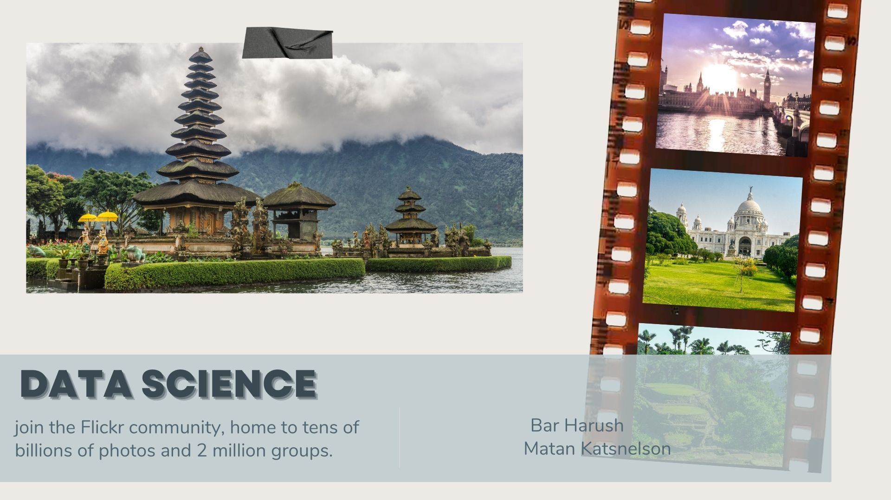
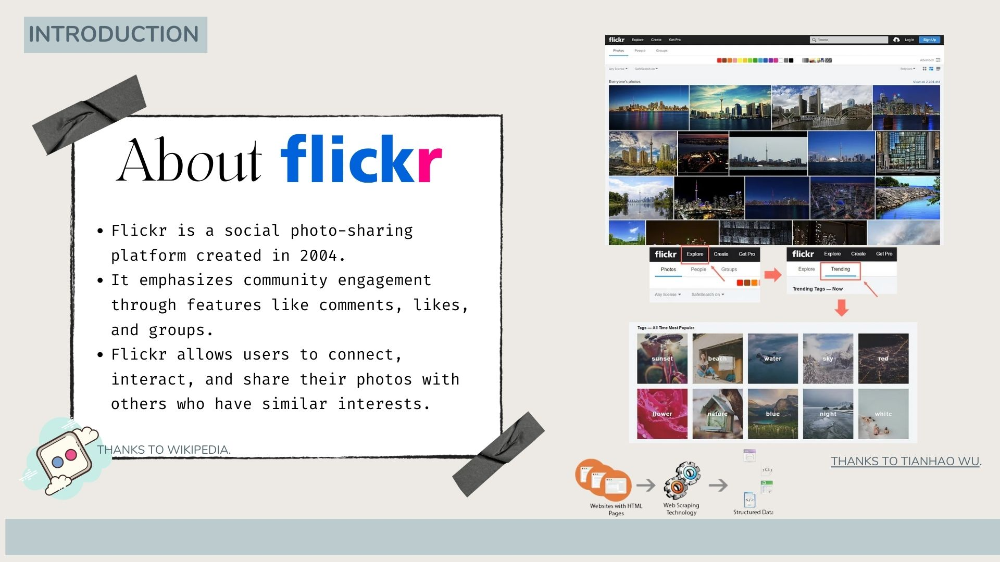
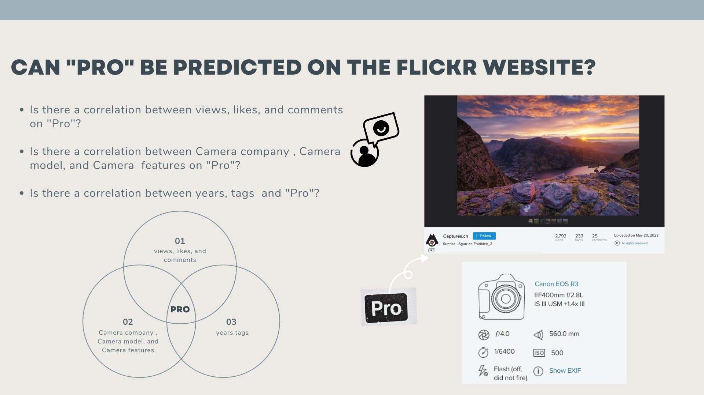
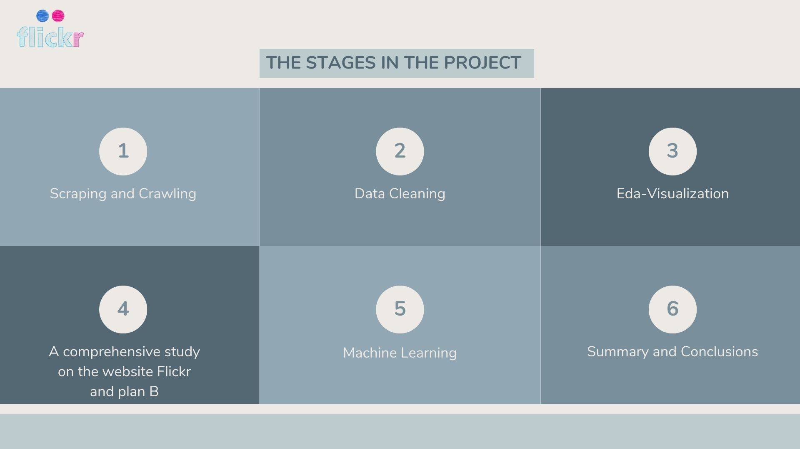
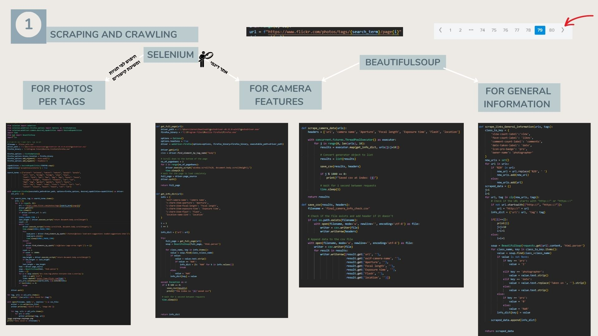
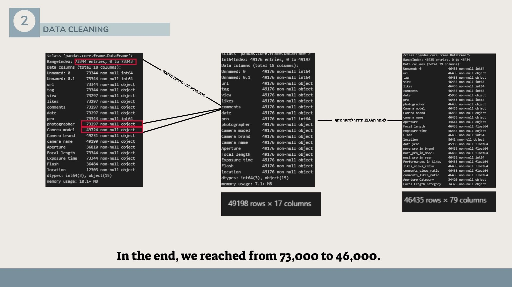
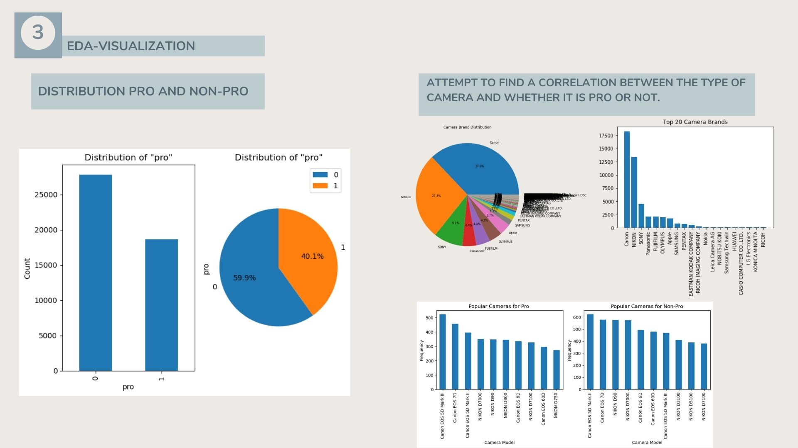
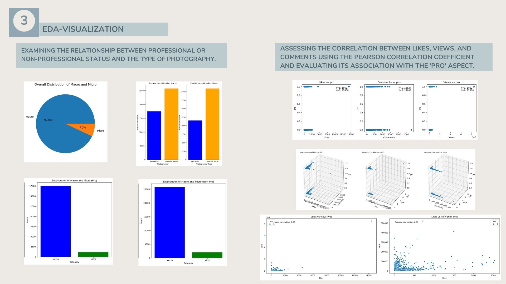
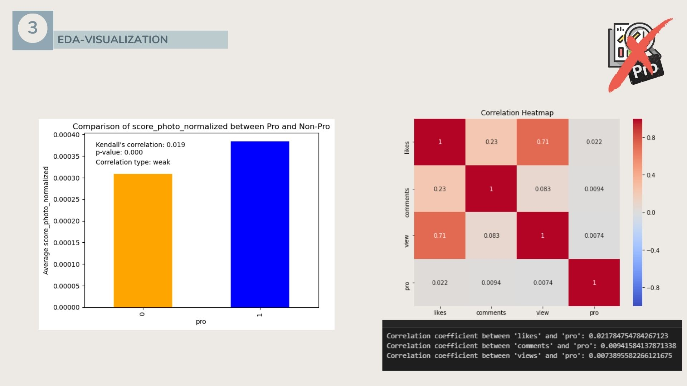
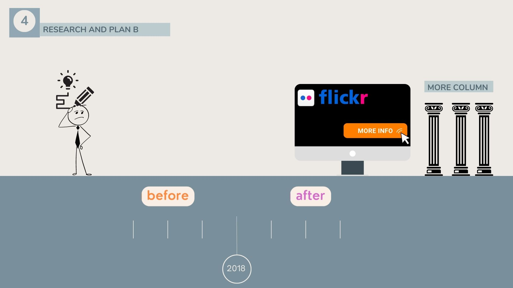
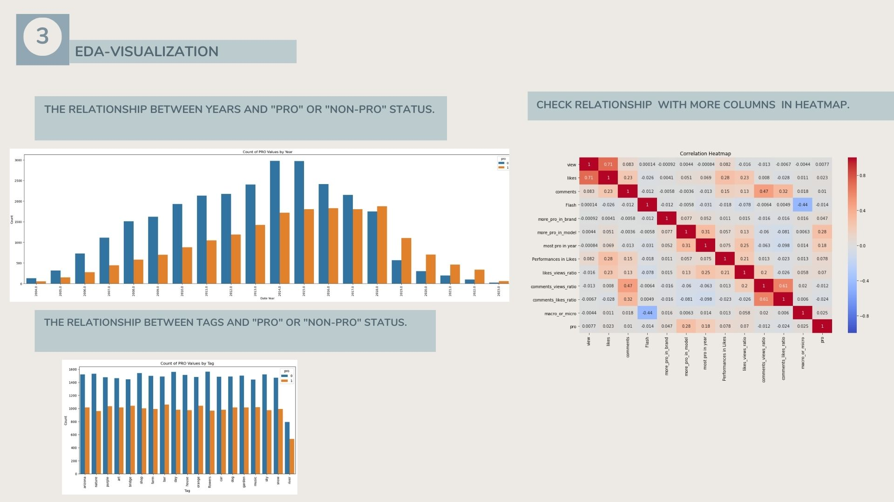
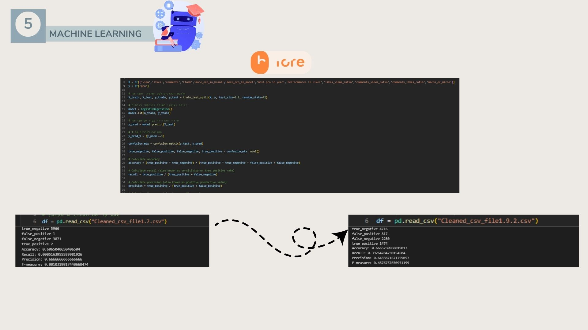
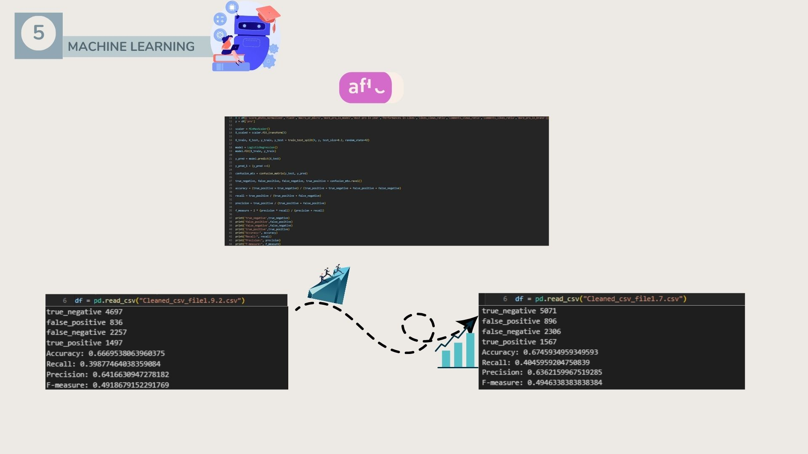
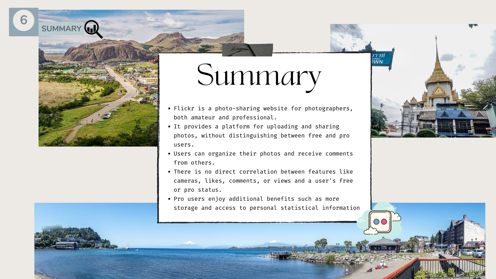
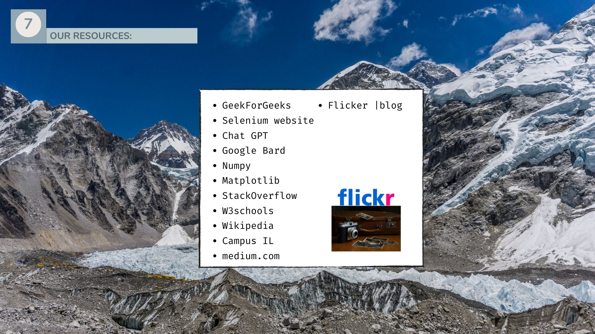

[Back To The Top](#top)
